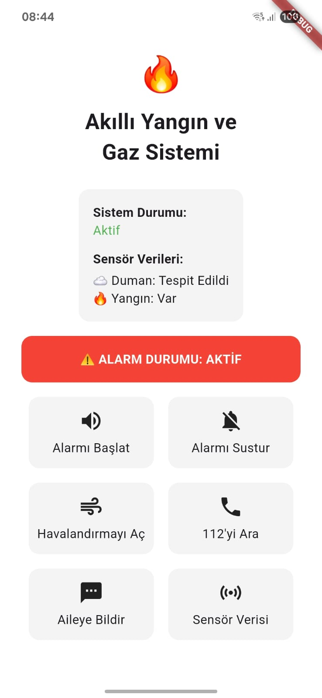

# Akıllı Yangın ve Gaz Algılama Sistemi (Smart Fire & Gas Detection System)

<div align="center">
  
  <br><br>
  
  [](https://flutter.dev/)
  [](https://dart.dev/)
  [](https://mqtt.org/)
  [](https://www.st.com/)
  [](https://www.espressif.com/)
</div>

## 📋 Proje Hakkında

Bu proje, ev ve endüstriyel alanlarda yangın ve zehirli gaz sızıntılarını erken aşamada tespit ederek kullanıcıları uyaran IoT tabanlı akıllı bir güvenlik sistemidir. Sistem, STM32 ve ESP32 mikrodenetleyicilerini kullanarak ortam verilerini işler ve **MQTT protokolü** üzerinden **Flutter** ile geliştirilmiş mobil uygulamaya anlık olarak iletir.

Kullanıcılar mobil uygulama üzerinden gaz seviyesini, sıcaklığı ve yangın durumunu takip edebilir; acil durumlarda **112'yi arama**, **alarmı susturma** veya **havalandırmayı açma** gibi aksiyonları uzaktan gerçekleştirebilirler.

## ✨ Temel Özellikler

**Gerçek Zamanlı İzleme:** Gaz (PPM), sıcaklık ve alev durumunun anlık takibi.
**Akıllı Uyarı Sistemi:** Tehlike anında mobil uygulamaya sesli ve görsel bildirim gönderimi.
**Hibrit Donanım Mimarisi:** STM32 (Veri Okuma) ve ESP32 (Wi-Fi İletişimi) entegrasyonu.
**Uzaktan Kontrol:** Mobil uygulama üzerinden alarm ve havalandırma sistemine müdahale.
**Acil Durum Yönetimi:** Tek tuşla 112 Acil Servis arama özelliği.

## 📸 Ekran Görüntüleri

| Mobil Uygulama Arayüzü |
|:-------------------------:|
|  |
| *Ana Kontrol Paneli: Sensör verileri ve acil durum butonları* |

## 🏗 Sistem Mimarisi

[cite_start]Sistem modüler bir yapıda tasarlanmıştır:

1.  **Algılama Katmanı:** MQ-2/MQ-135 ve alev sensörleri verileri toplar.
2.  **İşleme Katmanı (STM32):** Sensör verilerini işler ve röleleri kontrol eder.
3.  **İletişim Katmanı (ESP32):** İşlenen veriyi Wi-Fi üzerinden MQTT Broker'a (Mosquitto/HiveMQ) iletir.
4.  **Uygulama Katmanı (Flutter):** MQTT üzerinden gelen veriyi kullanıcıya sunar ve komut gönderir.

## 🛠 Kullanılan Teknolojiler

### Yazılım
* **Mobil Framework:** Flutter (Dart)
* **İletişim Protokolü:** MQTT (Message Queuing Telemetry Transport)
* **Gömülü Yazılım:** C (STM32CubeIDE), C++ (Arduino IDE)
* **Bildirimler:** flutter_local_notifications

### [cite_start]Donanım [cite: 86]
* **Mikrodenetleyici:** STM32F103C8T6
* **Wi-Fi Modülü:** ESP32 Dev Kit
* **Sensörler:** MQ-2 / MQ-135 Gaz Sensörü, Alev Sensörü
* **Diğer:** Röle Modülü (Alarm/Fan kontrolü için)

## 🚀 Kurulum

Projeyi yerel ortamınızda çalıştırmak için:

### 1. Mobil Uygulama
```bash
git clone [https://github.com/KULLANICI_ADIN/gaz_takip_sistemi.git](https://github.com/KULLANICI_ADIN/gaz_takip_sistemi.git)
cd gaz_takip_sistemi
flutter pub get
flutter run
